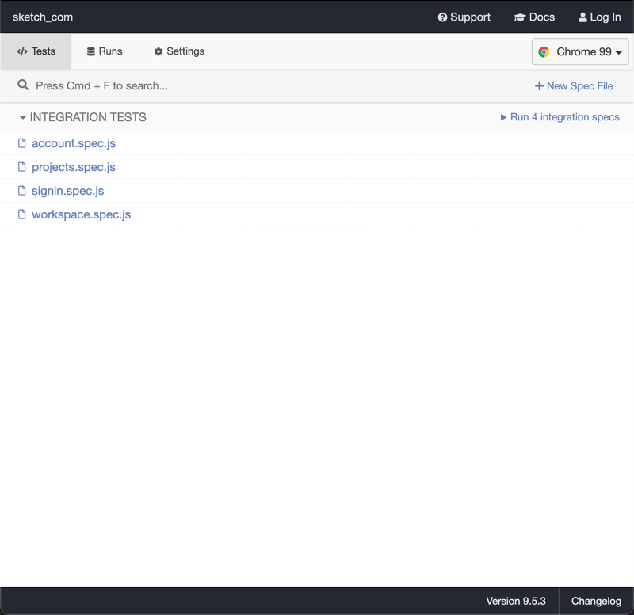

## Description

E2E testing sketch.com for:

    - Signin flow    
    - Account Page 
    - Projects Flow
    - Workspace Flow

## Test Cases:

### Login Flow:

- Validate Signin -> Signout
- Validate Signin page fields

### Account Page:

- Verify all Sections are present in the Page

### Projects Flow:

- Add and Delete a New project using left Bar
- Rename a Project using left Bar - Positivce scenario
- Create a Project with more that 100 characters - Negative scenario
- Rename a Project with more that 100 characters - Negative scenario
- Rename a Project with empty name using left Bar - Negative scenario
- Add project with already existing Name using left Bar - Negative scenario
- Rename project with already existing Name using left Bar - Negative scenario

### Workspace Flows:

- Create and Delete a Workspace

## Set-Up Environment

- Install NodeJS runtime in your local environment [https://nodejs.org/en/](https://nodejs.org/en/)
- Download a copy of this repo
- Open terminal go to the project path
- Install all requeriments:

```sh
  > npm install
```

- Set up local environment vars related to sketch.com credentials:

```sh
  > export cypress_user=email@email.com
  > export cypress_password=Password123!@#
```

- To execute this test Framework we have two options available:

  | Type | Command |
  | ------ | ------ |
  | headless | `npm run cypress:headless` |
  | graphical | `npm run cypress:graphical` |


